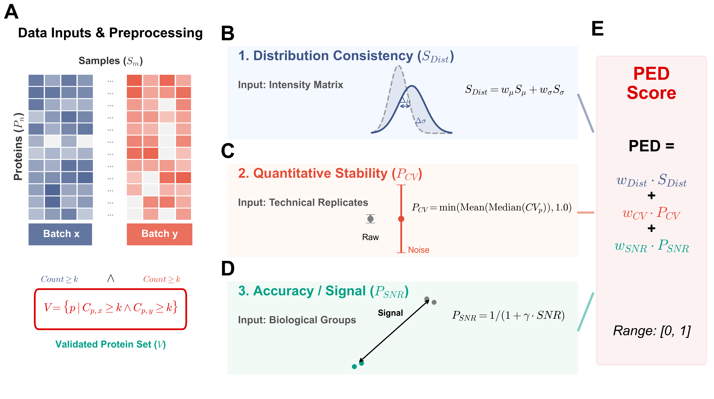

# PED (Protein Expression Difference)

**PED** is a comprehensive metric designed to evaluate batch effect correction in mass spectrometry-based proteomics. Unlike methods that prioritize mixing (e.g., kBET), PED balances the removal of technical bias with the preservation of biological signals to prevent over-correction.
<p align="center">
  
  <br>
  <em>Figure 1: The workflow of PED metric calculation.</em>
</p>

##  Key Features

PED calculates a composite score based on three dimensions:

1.  **Distributional Consistency ($S_{Dist}$):** Monitors location shifts and scale variations.
2.  **Quantitative Stability ($P_{CV}$):** Ensures reproducibility using technical replicates.
3.  **Accuracy ($P_{SNR}$):** Quantifies biological signal retention via Signal-to-Noise Ratio.

**Lower PED scores indicate better performance.**

$$PED = w_{Dist} \cdot S_{Dist} + w_{CV} \cdot P_{CV} + w_{SNR} \cdot P_{SNR}$$

##  Usage

### 1. Data Preparation

To run the evaluation, you need to prepare three CSV files. The filenames can be anything, but they must contain the specific information described below.

#### A. Metadata File
A table containing sample information. It **must** include the following columns (case-sensitive):

* `run_id`: The unique identifier for each measurement (Must match the column names in your expression matrices).
* `batch`: The batch label for each sample (used to define batch groups).
* `sample`: The biological sample label (used to calculate replicates and SNR).

| run_id       | batch   | sample | ... |
| :---         | :---    | :---   | :-- |
| Sample_01_A  | Batch_1 | S1     | ... |
| Sample_02_A  | Batch_1 | S2     | ... |
| Sample_01_B  | Batch_2 | S1     | ... |

#### B. Expression Matrices (Input & Output)
You need two expression matrices: one **before** batch correction (Raw/Log-transformed) and one **after** batch correction.

* **Rows**: Protein IDs (must be the index/first column).
* **Columns**: Must strictly match the `run_id` in the Metadata File.
* **Values**: Numeric expression values (Log2-transformed intensity is recommended).

| protein | Sample_01_A | Sample_02_A | Sample_01_B | ... |
| :---    | :---        | :---        | :---        | :-- |
| Prot_A  | 17.28       | 17.57       | 17.43       | ... |
| Prot_B  | 18.01       | 18.24       | 17.89       | ... |

### 2. Run Script

Open the main script and update the **Configuration** section to point to your actual file paths:

```python
# ==========================================
# 1. Configuration
# ==========================================
# Replace these paths with your actual data files
file_before = './path/to/your_raw_data.csv'       # Data BEFORE correction
file_after  = './path/to/your_corrected_data.csv' # Data AFTER correction
file_meta   = './path/to/your_metadata.csv'       # Metadata file
output_csv  = './path/to/save_report.csv'         # Where to save the result

### 3. Output & Interpretation

The script outputs a CSV file (e.g., `PED_report.csv`) containing comprehensive metrics for each batch pair.

#### Key Metrics Description

| Column | Description |
| :--- | :--- |
| **Total Score** | The weighted sum of all PED components. **Lower is Better (Range: 0-1)**. |
| **Improvement_Pct** | Percentage of score reduction after correction. **Positive values indicate improvement**. |
| **Dist** | **Distributional Consistency**. Measures how well the data distributions align. |
| **CV** | **Quantitative Stability**. Based on the Coefficient of Variation (CV) of technical replicates. |
| **Real_SNR** | **Signal-to-Noise Ratio**. The actual biological signal strength observed. **Higher is Better**. |
```

How to Interpret the Score

* **PED Score (Total):**
     A **lower** score indicates better batch correction performance.
     Ideally, the score should decrease after correction (i.e., `Total_After` < `Total_Before`).


